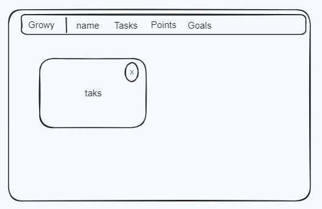
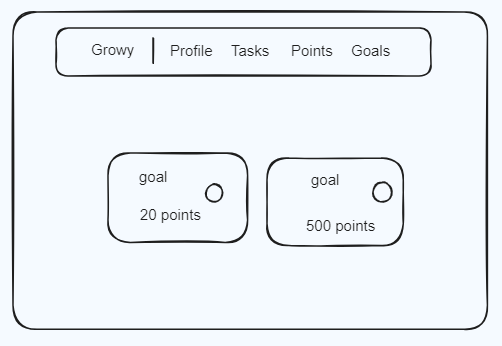
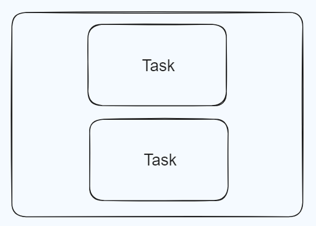
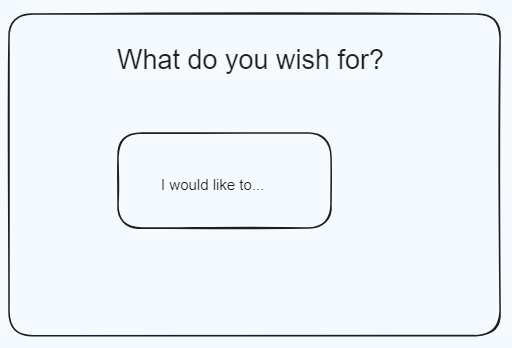
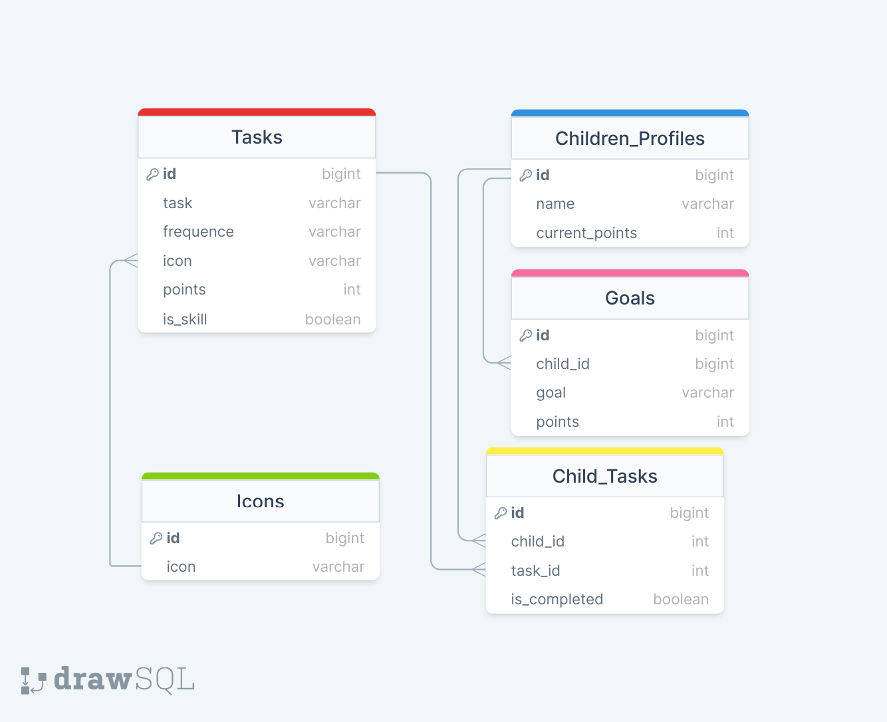

# Growy

## Overview

Growy is an app for diligent kids that tracks their chores and progresses, and encourage them to maintain good behavior and learn new tasks giving them satisfaction and little treats.

### Problem

I needed some way to encourage my kids to do their chores and be enthusiastic about it, something they would be happy to do rather than feel "forced" to do. No app I had previously used was satisfying me entirely, so I decided to build one.

### User Profile

There will be both parent and child profiles, so the children (of an appropriate age) can tick off their on tasks and the parents can confirm it and set the task as accomplished assigning points as well as take some out for extreme situations.

### Features

- Login for different users (parent or child)
- List of chores provided (common tasks can have some explanation to how to be performed)
- Chance to create new custom chores
- New skill learned (bit archievements such learning to ride a bike or to load a washing machine) will be highlighted
- List of wishes (kids can set a target to archieve, a specific gift, a trip somewhere)
- A point pot that can always be seen (and modified for the parent user)

## Implementation

### Tech Stack

- React.js
- Express
- MySQL
- Knex.js
- Sass
- Axios

#### Server Side Dependencies

- cors
- dotenv
- express
- knex
- mysql2

#### Client Side Dependencies

- axios
- react
- react-dom
- react-router-dom
- react-scripts
- sass

### APIs

- Icons sets by LemonadePixel, Alexis Rawlins

### Sitemap

- Login Page (Mockup)
- Family page (parent interface)
- Profiles pages (separate interface for parent and child)
- Tasks pages (separate interface for parent and child)
- Goals pages (separate interface for parent and child)

### Mockups

#### Login

#### Profile Page - Parent

#### Tasks Page - Parent

#### Points Page - Parent

#### Goals Page - Parent

#### Profile Page - Child

#### Tasks Page - Child

#### Points Page - Child

#### Goals Page - Child

### Data

### Endpoints

- GET /tasks/list
- GET /tasks/fast
- GET /icons
- GET /children
- GET /children/:id
- GET /children/goals
- GET /children/:id/goals
- POST /tasks/add
- POST /children/add
- POST /children/:id/add
- POST /children/:id/goals/add
- PATCH /children/:id
- PATCH /children/:id/tasks
- PATCH /children/goals/:id/
- DELETE /tasks/:id
- DELETE /children/:id
- DELETE /children/goals/:id
- DELETE /children/:id/tasks

### Auth

The Authorization will include separation of profiles for Parents and Children. This is a feature that will be applied in the future releses

## Roadmap

- MySQL Database setup and tables
- Assets provided and creation records
- Server setup and creation API endpoints with validations
- Client side UI with landpage and Login mockup
- Routing and creation pages
- Functional components and Hooks
- Graphic adaptation
- Testing phase
- Releasing prime version

## Nice-to-haves

Graphic improvements, drag & drop elements, animations. Possibility to negotiate tasks admission and user feedbacks
